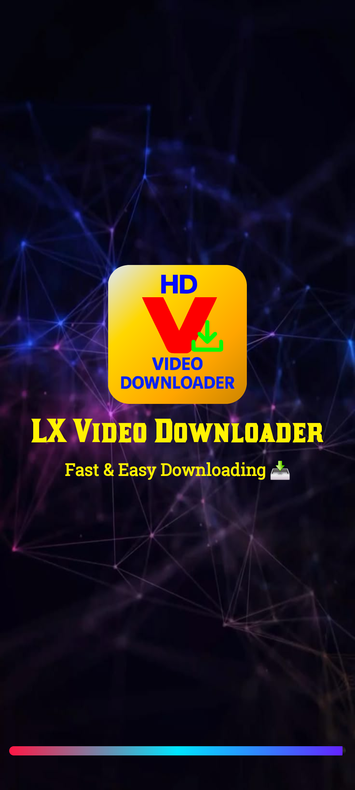
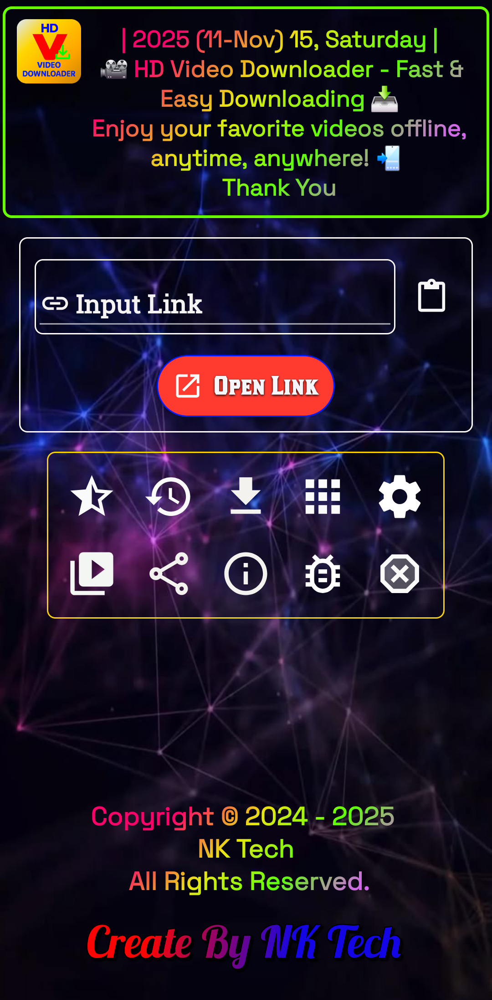
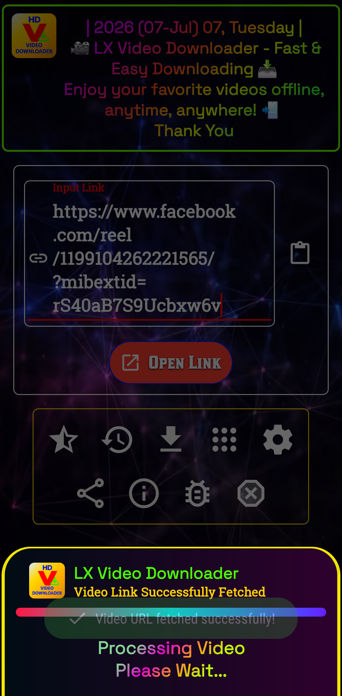
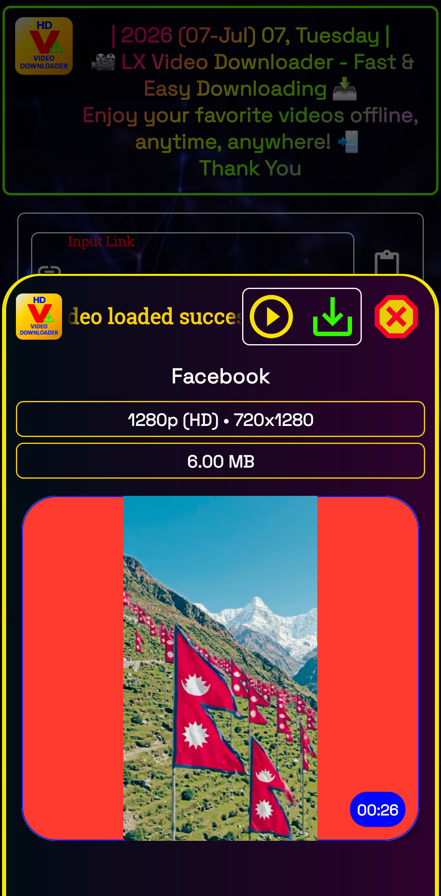
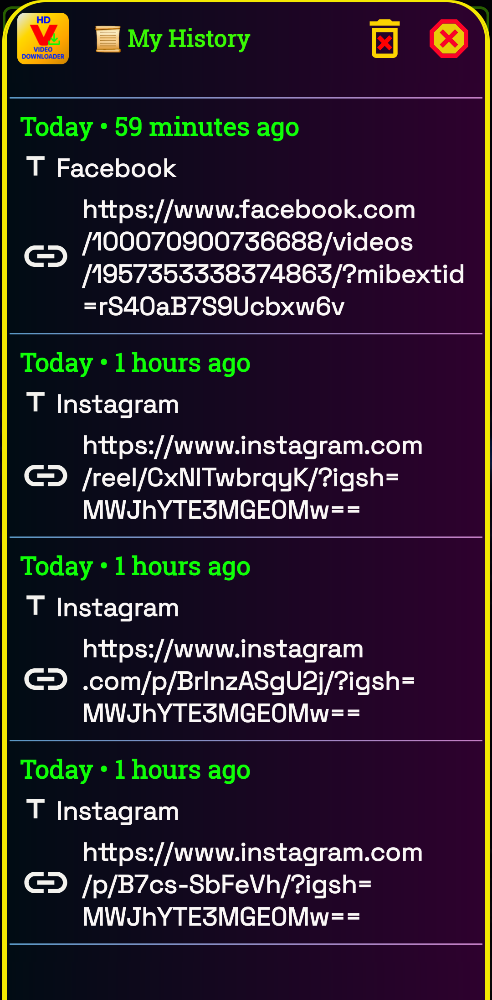
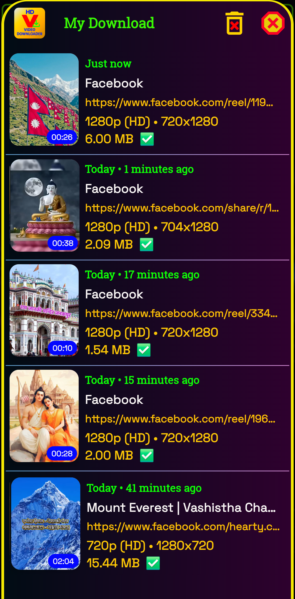
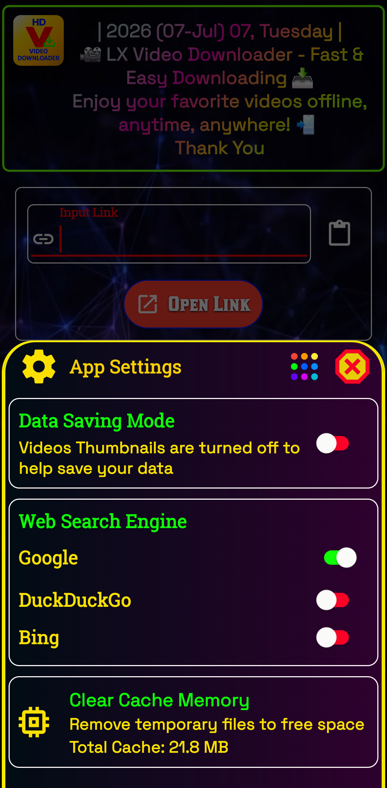
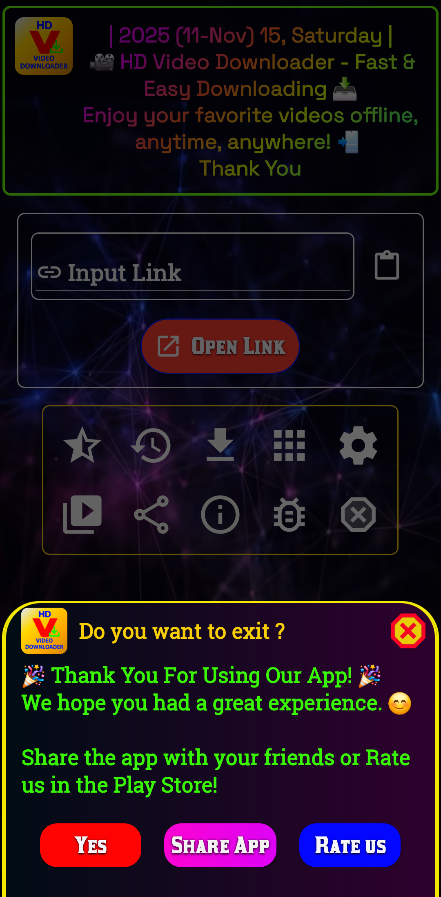

🎥LX Video Downloader ⬇️

A simple and powerful Android application designed to provide a fast, secure, and user-friendly experience.

## 📱 Features

- 🚀 Fast and lightweight
- 📥 Download HD videos with ease
- ▶️ Built-in video player
- 📂 Download history
- 🔗 Smart URL detection
- 🌐 Video Downloader supports multiple platforms:
    - 📘 Facebook Video Downloader
    - 📸 Instagram Video Downloader
    - 🎵 TikTok Video Downloader
    - 🐦 Twitter (X) Video Downloader
    - 🧵 Threads Video Downloader
    - 📌 Pinterest Video Downloader
    - 🎬 Dailymotion Video Downloader
    - 🔥 Moj Video Downloader
- 📁 Save videos to your preferred folder
- ⚡ Fast download speeds
- 🔒 Secure and reliable
- 📱 Clean and user-friendly interface
- 📤 Share videos directly from supported apps
- ❌ No login required
---

## 📥 Download on Google Play

---

## 📸 Screenshots

<table>
  <tr>
    <td></td>
    <td></td>
    <td></td>
    <td></td>
  </tr>
  <tr>
    <td></td>
    <td></td>
    <td></td>
    <td></td>
  </tr>
</table>

## 📧 Contact

**Developer:** NK Tech(NP)

Email: ournktech@gmail.com

Website: https://ournktech.com/

---

## ⭐ Support

If you like this project, please give it a ⭐ on GitHub!

---

## 📄 License

This project is licensed under the MIT License.
